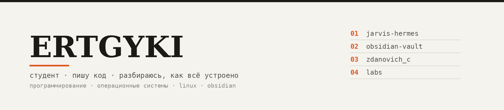

  

Студент. Пишу код и люблю разбираться, как всё устроено внутри — от операционных
систем до небольших проектов «для себя». ИИ — одно из увлечений, не единственное.

### Чем занимаюсь

- **программирование** — сейчас в основном C, учусь и много пробую руками;
- **операционные системы и Linux** — установка, настройка, внутреннее устройство;
- **знания** — держу конспекты и заметки в порядке в Obsidian;
- **на досуге** — автоматизация рутины и эксперименты с голосовыми ассистентами.

### Проекты

| | Репозиторий | О чём |
| --- | --- | --- |
| 01 | [**jarvis-hermes**](https://github.com/debug999-cyber/jarvis-hermes) | голосовой ассистент для macOS — большой личный проект |
| 02 | [**obsidian-university-vault**](https://github.com/debug999-cyber/obsidian-university-vault) | база знаний по учёбе в Obsidian |
| 03 | [**zdanovich_c**](https://github.com/debug999-cyber/zdanovich_c) | контрольная по программированию на C |
| 04 | [**labs**](https://github.com/debug999-cyber/labs) · [serov-lab2-fix](https://github.com/debug999-cyber/serov-lab2-fix) · [serov-lab3](https://github.com/debug999-cyber/serov-lab3) | лабораторные по ОС и Linux |

Ещё пара приватных репозиториев для себя — **agent-core** и **commonplace-vault**.

### Инструменты

`Python`  ·  `C`  ·  `Bash`  ·  `JavaScript`  ·  `Linux`  ·  `Obsidian`  ·  `Git`

---

Здесь мои учебные и личные проекты — не по работе, просто из интереса.
